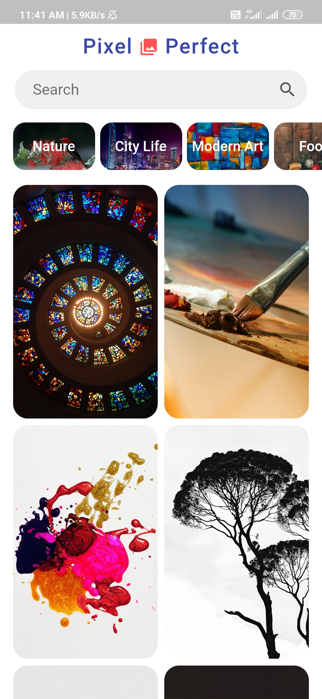

# Pixel Perfect (Wallpapers App)

Pixel perfect is a simple, easy to use, refreshing wallpaper app built using **Flutter** and **Pexels API** which allows users to exxplore, search and download beautiful wallpapers (updated in regular intervals). 

## Backdrop

Was bored and fed up of using existing wallpapers/backgrounds app filled with ads, so made an app to explore Flutter and create a simple, yet *fully functional* wallpapers app alongwith download (save in gallery) functionality.

## Features

- [x] Wallpaper Categories
- [x] Search Wallpapers
- [x] Download Image (save to gallery)
- [x] Curated list of wallpapers
- [ ] ~~Set wallpaper from app itself~~ 

## Learnings

'''
- Flutter Widgets
- Handling API
- Handling App Permissions
- Cache Management
'''

## Screenshots

   

## Contact Me

If you have any doubts, and/or suggestions, feel free to contact me at @neerajjain311@gmail.com 
